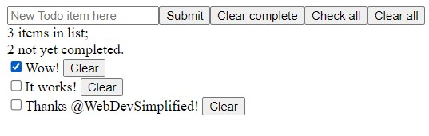

# Generic React todo app

This react app is based on <a href="https://www.youtube.com/@WebDevSimplified">WebDevSimplified</a>'s <a href="https://www.youtube.com/watch?v=hQAHSlTtcmY">React crash course</a>, with some additional features.

Supports:

- adding an item
- editing an item
- checking off an item
- clearing an item, and
- clearing all checked items.
   
  Check / Uncheck all button dynamically checks whether items are completed.
  Display number of items in the list and number of items not checked.
  You can use <kbd>Enter</kbd> key to add an item instead of clicking on the `Submit` button.
  Added items are persistent in localStorage.

