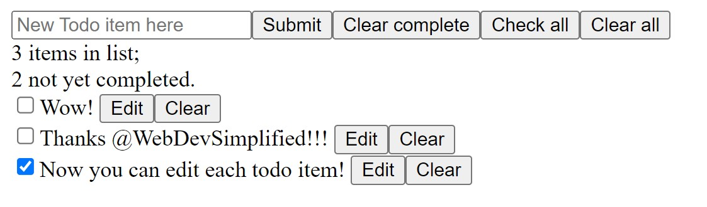

# Generic React todo app

This react app is based on <a href="https://www.youtube.com/@WebDevSimplified">WebDevSimplified</a>'s <a href="https://www.youtube.com/watch?v=hQAHSlTtcmY">React crash course</a>.

Supports adding an item, checking an item, clearing an item, and clearing all checked items.
Check / Uncheck all button dynamically checks whether items are completed.
Display number of items in the list and number of items not checked.
You can use the "enter" key to add an item instead of clicking on the `submit` button.
Added items are stored in localStorage.

